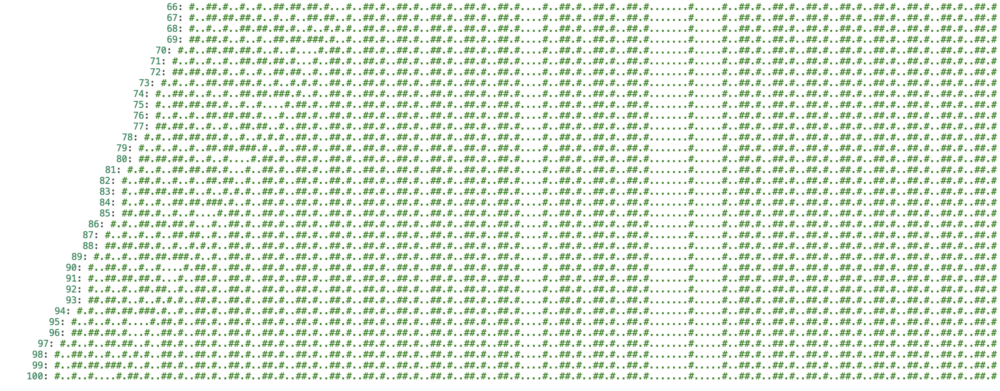

# Day 12: [Subterranean Sustainability](https://adventofcode.com/2018/day/12)

## Part 1

For part 1, a brute-force approach with some ugly shortcuts (padding at beginning and the end) did the job.

I implemented the instructions as a vector of 32 elements, since the patterns can be bit-mapped to numbers 0 to 31.

## Part 2

With 50 billions, it was not going to be brute force for sure. There had to be some pattern in the data, and indeed there was: From generation 125, it's the same pattern all the time, just shifting.

Seeing the pattern was done by trimming all the '.' from the beginning and the end. Unfortunately, I initially only printed up to 100 generations, so it wasn't fully obvious immediately, until I right aligned the strings: Then it was clear it was converging somewhere.

