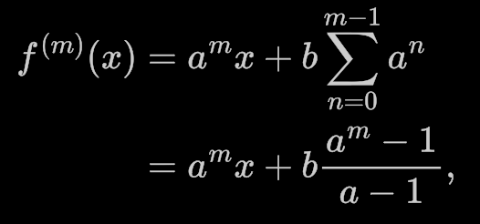

# Day 22: [Slam Shuffle](https://adventofcode.com/2019/day/22)

## Part 1

Part 1 was nothing complicated. Just the interesting question being which data structure would better for the deck? I used as a Vec, as for the fast part 1, there was no noticable difference with a VecDeque.

## Part 2

Part 2 was a tough one, really.

### Tracking positions only

What was immediately clear is that we should be tracking the position of a single card, not handle the full deck anymore. So I reimplemented the part 1 by tracking one card only (module `card_only`, while the full deck version is in `full_deck`).

### Reversing the shuffling

The second thing I understood was that I would have to apply the shuffle process reversed. So I implemented a reversed version of each shuffle method. This was easy for "deal new stack" and "cut n", but much harder for "deal with increment". I got stuck a while on this one, until I found the mathematical concept I needed, "modular multiplicative inverse", for which I found an implementation.

### No periodicity..

I had assumed that once I would have this, I would find a periodicity in the shuffling, to speed things up. But there wasn't any periodicity. Stuck again.

### Shuffling as a linear function

I had to look for a small hint, which was the term "linear function". It turns out that each shuffle operation can be expressed in the form of a function like:

    f(x) = a * x + b

or also `(a * x + b) % deck_size`.

*Deal new stack:* `deck - 1 - pos`

which is equivalent to `(deck - 1 - pos) % deck`

- a = -1
- b = -1 + deck

*Cut n:* `(pos - n) % deck`

- a = 1
- b = -n

*Deal with increment:* `(pos * n) % deck`

- a = n
- b = 0

When you combine several linear functions, you still have a linear function, so the whole shuffle operation is also of the form `(a * x + b) % deck_size`.

This means I could take two points x0;y0 and x1;y2 and resolve the equations:

    y0 = a * x0 + b
    y1 = a * x1 + b

    b = y0 - a * x0
    a = (y1 - y0) / (x1 - x0)

and choosing smarly x0 = 0 and x1 = 1:

    a = y1 - y0
    b = y0

### Applying the linear function a trillion times

Even if the whole shuffling was very fast now, doing that a trillion times was still not realistic.

I had to look for a hint again, and found that there is a function for this as well:

Into code, it becomes something like:

    ( p1 * pos + b * p2 ) % deck_size

    p1 = pow(a, shuffle_count) % deck_size
    p2 = (p1 - 1) * pow(a - 1, deck_size - 2) % deck_size

Calculating this in Rust required the `BigInt` crate and it's modular exponentiation function `modpow`.
