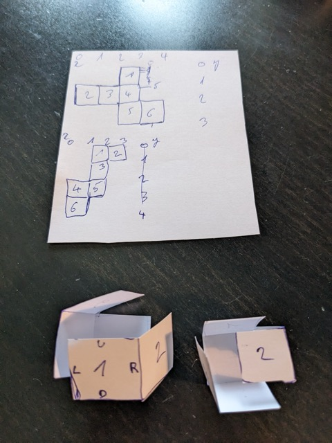

# Day 22: [Monkey Map](https://adventofcode.com/2022/day/22)

## Part 1

The non-rectangular map required a bit of thinking for the parsing and map implementation. I settled with a solution where the whole map is surrounded with a "void" tile. It makes the parsing fairly easy and especially it allows to avoid fully any boundary checking via indexes.

The code is a bit verbose, with lots of enums.

## Part 2

First I did refactorings to make the Map struct agnostic to the wrapping model.

With the input folding being different for test and real, and rather tricky to generalize, I implemented hard-coded solutions for test and real input. I used a paper cube to figure out the wrapping.

Maybe some day I will do a generic solution.